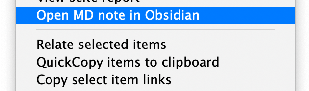

# Zotero Obsidian Citations

- **_Adds colored tags to Zotero items that have associated Markdown notes stored in an external folder._**
- **_Open an associated Markdown note from the contextual menu of a Zotero item._**

This is an add-on for [Zotero](https://www.zotero.org), a research source management tool. The _ZoteroObsidianCitations_ add-on finds files marked with BibTeX keys in an external folder and adds a colored tag to the corresponding Zotero items.

Currently this add-on is primarily designed to be a minimal companion to the [obsidian-citation-plugin](https://github.com/hans/obsidian-citation-plugin), a plugin for [Obsidian](https://obsidian.md) Markdown editor, but it can be adapted to other workflows and databases used to store reading notes outside of Zotero.

Please post any bugs, questions, or feature requests in the Github repository.

## Plugin Functions

Adds a colored tag to Zotero items for which there are associated reading notes in an external folder.

Opens an existing Markdown note in [Obsidian](https://obsidian.md) from the contextual menu of a Zotero item.

## Instalation

- Download the add-on (the .xpi file) from the latest release: https://github.com/daeh/zotero-obsidian-citations/releases
- To download the .xpi file, right click it and select 'Save link as'
- Run Zotero (version 5.x)
- Go to `Tools -> Add-ons`
- `Install Add-on From File`
- Choose the file `zotero-obsidian-citations-0.0.11.xpi`
- Restart Zotero

## Setup

_ZoteroObsidianCitations_ can map Markdown notes to Zotero items in two ways:

1. Using **[Better BibTex](https://retorque.re/zotero-better-bibtex/) citekeys**.

   - This is recommended if you created the Markdown notes using [obsidian-citation-plugin](https://github.com/hans/obsidian-citation-plugin).

   - The Markdown file names should start with `@mycitekey` but can include extra information after it (e.g. a reading note might have the file name `@shepard1987science.md` or `@shepard1987science Toward a universal law of generalization for psychological science.md`, where `shepard1987science` is the BetterBibTex citekey).

2. Using **Zotero Item Keys**.

   - This is recommended if you created the Markdown notes using the `Export Note` feature of Zotero.
   - The Markdown file names should start with `@` and the file contents should include the Zotero-Item-Key in a consistent format
     (Zotero automatically generates Item Keys; they take the form of `ABCD1234`, as in `zotero://select/library/items/ABCD1234`).

### Using BetterBibTex citekeys

- In `ZoteroObsidianCitations Preferences...` (under the `Tools` menu),

  - Specify the location of the folder that contains your Markdown reading notes (e.g. `/Users/me/Documents/ObsVault/ReadingNotes/`). The _ZoteroObsidianCitations_ add-on will recursively search this path for Markdown files beginning with `@`.
  - Select the `Match notes based on BetterBibTex citekey` option.

    - _ZoteroObsidianCitations_ expects that the filenames of your Markdown reading note files begin with `@mycitekey` but can include extra information after it (e.g. a reading note might have the file name `@shepard1987science.md` or `@shepard1987science Toward a universal law of generalization for psychological science.md`, where `shepard1987science` is the BBT citekey).

  - Optionally, you can have _ZoteroObsidianCitations_ read the metadata of your Markdown notes and extract the citekey from one of the fields. To enable this, specify the metadata ID (`citekey` is a common value).
    - This is necessary if the file names do not begin with the correct citekey, which may happen if the citekeys include special characters (e.g. if a citekey contains `:`, it will probably need to be taken from the yaml metadata rather than the filename).

- Run the synchronization function from `Tools -> ZoteroObsidianCitations Sync Tags`.
- This will add a tag (`ObsCite`) to every Zotero item for which there exists a reading note in the external folder you specified.
- In the `Tags` plane of Zotero, right-click on the `ObsCite` tag and assign it a color, which will mark the tagged items in the preview plane of Zotero.

### Using Zotero Item Keys

If your Markdown notes contain the Zotero-Item-Keys, you can specify a RegEx pattern to extract the key from the file contents. Zotero automatically generates Item Keys under the hood; they take the form of `ABCD1234`, as in `zotero://select/library/items/ABCD1234`. NB this is not the same as the BBT citekey you assigned an item (e.g. `mycitekey` in `zotero://select/items/@mycitekey`).

- In `ZoteroObsidianCitations Preferences...` (under the `Tools` menu),

  - Select the `Match notes based on Zotero-Item-Key` option.

    - _ZoteroObsidianCitations_ expects that the filenames of your Markdown reading note files begin with `@`.

  - Specify a RegEx pattern to extract the Zotero-Item-Key from the Markdown contents.

  - E.g. if your note has the line

    `- local:: [local zotero](zotero://select/library/items/GZ9DQ2AM)`

    you could extract the Zotero key (`GZ9DQ2AM`) using this RegEx pattern:

    `^- local::.+\/items\/(\w+)\)`

- Run the synchronization function from `Tools -> ZoteroObsidianCitations Sync Tags`.

- This will add a tag (`ObsCite`) to every Zotero item for which there exists a reading note in the external folder you specified.

- In the `Tags` plane of Zotero, right-click on the `ObsCite` tag and assign it a color, which will mark the tagged items in the preview plane of Zotero.

## Notes

[GitHub](https://github.com/daeh/zotero-obsidian-citations): Source code repository

Code for this extension is based on [ZotFile](https://github.com/jlegewie/zotfile) and [Zotero Citationcounts](https://github.com/eschnett/zotero-citationcounts) (which is based on [Zotero DOI Manager](https://github.com/bwiernik/zotero-shortdoi), which is based in part on [Zotero Google Scholar Citations](https://github.com/beloglazov/zotero-scholar-citations)).

## License

Distributed under the MIT License.
