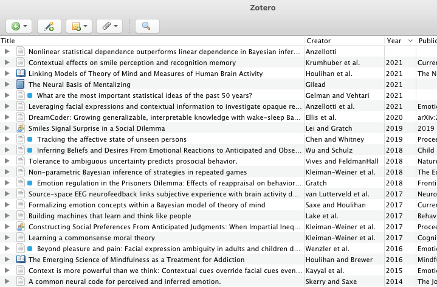

# Zotero Obsidian Citations

_Add colored tags to Zotero items that have associated MarkDown notes in an external folder._

This is an add-on for [Zotero](https://www.zotero.org), a research source management tool. The ZoteroObsidianCitations add-on finds files marked with BibTeX keys in an external folder and adds a colored tag to the corresponding Zotero items.

This is a companion to the [obsidian-citation-plugin](https://github.com/hans/obsidian-citation-plugin), a plugin for [Obsidian](https://obsidian.md) markdown editor, but can work with a variety of databases used to store reading notes outside of Zotero.

Please report any bugs, questions, or feature requests in the Github repository.

## Plugin Functions

Adds a colored tag to Zotero items for which there are associated reading notes in an external folder. Currently this add-on is primarily a minimal companion to the [obsidian-citation-plugin](https://github.com/hans/obsidian-citation-plugin), but it can be adapted to other workflows.

## Instalation

- Download the add-on (the .xpi file) from the latest release: https://github.com/daeh/zotero-obsidian-citations/releases
- To download the .xpi file, right click it and select 'Save link as'
- Run Zotero (version 5.x)
- Go to `Tools -> Add-ons`
- `Install Add-on From File`
- Choose the file `zotero-obsidian-citations-0.0.6.xpi`
- Restart Zotero

## Setup

ZoteroObsidianCitations needs to map your BetterBibTex (BBT) citekeys to the corresponding Zotero Item IDs. The easiest way to do this is to specify the path to an auto-updating BBT JSON export of your library. Alternatively, if your MarkDown notes include the Zotero Item Key, you can specify a RegEx pattern to extract the ZoteroKey from the note content.

### _BetterBibTex JSON_ Export Method

If you're already using [obsidian-citation-plugin](https://github.com/hans/obsidian-citation-plugin), you've set up an auto-updating BetterBibTex (BBT) export of your library. You'll now need to make another BBT export that contains both the BBT citekeys and the Zotero item IDs.

- Export your library in the "**_BetterBibTex JSON_**" format (not "_Better CSL JSON_", which does not include the Zotero IDs).
  - Click `File -> Export library`.
  - Check the "Keep Updated" box in the export options.
  - You can save this JSON anywhere, but it usually makes sense to save it next to the BBT export that `obsidian-citation-plugin` uses.
- In `ZoteroObsidianCitations Preferences...` (under the `Tools` menu),

  - Specify the location of the "_BetterBibTex JSON_" formatted file you just exported.
  - Specify the location of the folder that contains your `obsidian-citation-plugin` reading notes (e.g. `/Users/me/Documents/ObsVault/ReadingNotes/`).

    - NB this add-on expects that your reading note files begin with `@citekey` (e.g. a reading note might have the file name `@shepard1987science Toward a universal law of generalization for psychological science.md`, where `shepard1987science` is the BBT citekey).

  - Optionally, you can have ZoteroObsidianCitations read the metadata of your markdown notes and extract the citekey from one of the fields. To enable this, specify the metadata ID (`citekey` is a common value).

- Run the synchronization function from `Tools -> ZoteroObsidianCitations Sync Tags`.
- This will add a tag ( `ObsCite`) to every Zotero item for which there exists a reading note in the external folder you specified.
- In the `Tags` plane of Zotero, right click on the `ObsCite` tag and assign it a color, which will mark the tagged items in the preview plane of Zotero.

### MarkDown RegEx Method

- Rather than exporting your library in the _BetterBibTex JSON_ format, specify a custom RegEx pattern in `ZoteroObsidianCitations Preferences...` to extract the Zotero Item Key from your MarkDown notes.

  - E.g. if your note has the line

    `- local:: [local zotero](zotero://select/library/items/GZ9DQ2AM)`

    you could extract the Zotero key (`GZ9DQ2AM`) using this RegEx pattern:

    `^- local:: \[local zotero\]\(zotero:\/\/select\/library\/items\/(.+)\)`

- Follow the instructions above to specify the path to your MarkDown notes, the metadata ID (optional), and color the `ObsCite` tag.

## Notes

[GitHub](https://github.com/daeh/zotero-obsidian-citations): Source code repository

Code for this extension is based on [ZotFile](https://github.com/jlegewie/zotfile) and [Zotero Citationcounts](https://github.com/eschnett/zotero-citationcounts) (which is based on [Zotero DOI Manager](https://github.com/bwiernik/zotero-shortdoi), which is based in part on [Zotero Google Scholar Citations](https://github.com/beloglazov/zotero-scholar-citations) by Anton Beloglazov).

## License

Distributed under the MIT License.
