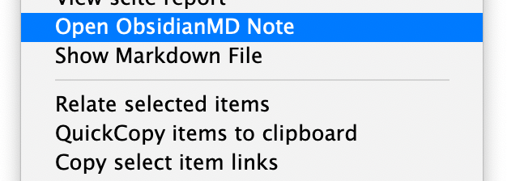

[](https://github.com/daeh/zotero-markdowndb-connect/releases/latest) 

# MarkDBConnect (Zotero Obsidian Citations)

- **_Adds colored tags to Zotero items that have associated Markdown notes stored in an external folder._**
- **_Opens Markdown notes from the contextual menu of Zotero items._**


This is an plugin for [Zotero](https://www.zotero.org), a research source management tool. The _MarkDBConnect_ plugin searchs an user-defined folder for Markdown files that include a [Better BibTeX](https://retorque.re/zotero-better-bibtex/) citekey or Zotero Item Key, and adds a colored tag to the corresponding Zotero items.

Currently this plugin designed with the [Obsidian](https://obsidian.md) Markdown editor in mind, and was inspired by the [obsidian-citation-plugin](https://github.com/hans/obsidian-citation-plugin) workflow. It can be adapted to other databases that store Markdown files outside of Zotero, and to other workflows that generate Markdown reading notes linked to Zotero items (such as Zotero's `Export Note` feature).

Please post any bugs, questions, or feature requests in the Github repository.

## Plugin Functions

Adds a colored tag to Zotero items for which there are associated reading notes in an external folder.

Supports multiple Markdown files for a single Zotero item.

Opens an existing Markdown note in [Obsidian](https://obsidian.md) from the contextual menu of a Zotero item.



## Instalation

- Download the plugin (the .xpi file) from the latest release: https://github.com/daeh/zotero-markdowndb-connect/releases
- To download the .xpi file, right click it and select 'Save link as'
- Run Zotero (version 5.x or 6.x)
- Go to `Tools -> Add-ons`
- `Install Add-on From File`
- Choose the file `MarkDBConnect-0.0.17.xpi`
- Restart Zotero

## Setup

A Markdown file can specify which Zotero item it's linked to using either a [Better BibTeX](https://retorque.re/zotero-better-bibtex/) citekey or a Zotero-Item-Key.

1. Link Markdown files to Zotero items using **Better BibTeX citekeys**.

   - This is recommended if you created the Markdown notes with [obsidian-citation-plugin](https://github.com/hans/obsidian-citation-plugin).

   - The BetterBibTeX citekey needs to appear in the filename or the metadata of the Markdown note.

2. Link Markdown files to Zotero items using **Zotero Item Keys**.

   - This is recommended if you created the Markdown notes with the `Export Note` feature of Zotero.
   - The Markdown note contents should include the Zotero-Item-Key in a consistent format.

NOTE: Multiple Markdown files can point to the same Zotero item. However, _MarkDBConnect_ assumes that a given Markdown file corresponds to a single Zotero item. (A Markdown reading note can reference multiple Zotero items throughout the file, but _MarkDBConnect_ will only link the Markdown note to one BetterBibTeX-citekey / Zotero-Item-Key.)

---

### Option 1: Using BetterBibTeX citekeys

_MarkDBConnect_ can extract the BetterBibTeX citekey that specifies which Zotero Item a Markdown note corresponds to. The BetterBibTeX citekey can be taken from the Markdown filename or yaml metadata.

- In `MarkDBConnect Preferences...` (under the `Tools` menu),

  - Specify the location of the folder that contains your Markdown reading notes (e.g. `/Users/me/Documents/ObsVault/ReadingNotes/`). The _MarkDBConnect_ plugin will recursively search this path for Markdown files.

    - The default behavior is to search for markdown files beginning with `@`.
    - Alternatively, you can specify a RegEx pattern to match your reading note files.

  - Select the `Match notes based on BetterBibTeX citekey` option.

    - By default, _MarkDBConnect_ expects that the filenames of your Markdown reading note files begin with `@mycitekey` but can include extra information after it (e.g. a reading note with the BetterBibTeX citekey `shepard1987science` could have the file name `@shepard1987science.md` or `@shepard1987science Toward a universal law of generalization for psychological science.md`).

  - Optionally, you can have _MarkDBConnect_ read the metadata of your Markdown notes and extract the citekey from one of the fields. To enable this, specify the metadata ID (`citekey` is a common value).

    - This is necessary if the file names do not begin with the correct citekey, which may happen if the citekeys include special characters (e.g. if a citekey contains `:`, it will probably need to be taken from the yaml metadata rather than the filename).

- Run the synchronization function from `Tools -> MarkDBConnect Sync Tags`.
  - This will add a tag (`ObsCite`) to every Zotero item for which there exists a reading note in the external folder you specified.
- In the `Tags` plane of Zotero, right-click on the `ObsCite` tag and assign it a color, which will mark the tagged items in the preview plane of Zotero.

---

### Option 2: Using Zotero Item Keys

_MarkDBConnect_ can extract the Zotero-Item-Key that specifies which Zotero Item a Markdown note corresponds to. The Zotero-Item-Key is taken from the Markdown file contents using a custom RegEx pattern.

Zotero automatically generates Item Keys, they take the form of `ABCD1234`, as in `zotero://select/library/items/ABCD1234`. NB this is not the same as the BetterBibTeX citekey you assigned an item (e.g. `mycitekey` in `zotero://select/items/@mycitekey`).

- In `MarkDBConnect Preferences...` (under the `Tools` menu),

  - Specify the location of the folder that contains your Markdown reading notes (e.g. `/Users/me/Documents/ObsVault/ReadingNotes/`). The _MarkDBConnect_ plugin will recursively search this path for Markdown files.

    - The default behavior is to search for markdown files beginning with `@`.
    - Alternatively, you can specify a RegEx pattern to match your reading note files.

  - Select the `Match notes based on Zotero-Item-Key` option.

  - Specify a RegEx pattern to extract the Zotero-Item-Key from the Markdown contents.

    E.g. if your note has the line

    `- local:: [local zotero](zotero://select/library/items/GZ9DQ2AM)`

    you could extract the Zotero key (`GZ9DQ2AM`) using this RegEx pattern:

    `^- local::.+\/items\/(\w+)\)`

- Run the synchronization function from `Tools -> MarkDBConnect Sync Tags`.
  - This will add a tag (`ObsCite`) to every Zotero item for which there exists a reading note in the external folder you specified.
- In the `Tags` plane of Zotero, right-click on the `ObsCite` tag and assign it a color, which will mark the tagged items in the preview plane of Zotero.

---

## Example Markdown Note

In this example Markdown note (`@saxe2017emobtom.md`), the _MarkDBConnect_ will use the yaml metadata keyword `citekey` to find the BetterBibTeX citekey (`saxe2017emobtom`) to determine which Zotero item to associate with the Markdown file. Notice that the Markdown file can include other BetterBibTeX citekeys and Zotero-Item-Keys, which are ignored by the plugin.

```markdown
---
citekey: saxe2017emobtom
doi: 10.1016/j.copsyc.2017.04.019
zoterouri: zotero://select/library/items/IACZMXU4
bbturi: zotero://select/items/@saxe2017emobtom
---

# Formalizing emotion concepts within a Bayesian model of theory of mind

[A reference using a Zotero URI](zotero://select/library/items/4RJ97IFL)

[A reference using a BetterBibTeX URI](zotero://select/items/@anzellotti2021opaque)

A reference using an Obsidian wiki link: [[@cusimano2018cogsci]]
```

## Related Projects

- [obsidian-citation-plugin](https://github.com/hans/obsidian-citation-plugin)
  Obsidian plugin that integrates your Zotero database with Obsidian.
- [BibNotes Formatter](https://github.com/stefanopagliari/bibnotes)
  Obsidian plugin to facilitate exporting annotations from Zotero into Obsidian.
- [Obsidian Zotero Desktop Connector](https://github.com/mgmeyers/obsidian-zotero-desktop-connector)
  Obsidian plugin to facilitate exporting annotations from Zotero into Obsidian.
- [Zotero 6 'Export Notes' feature](https://forums.zotero.org/discussion/93521/available-for-beta-testing-markdown-export-of-notes/p1)
  Zotero 6 beta feature to export notes and annotations from Zotero items as Markdown files.
- [Zotero-mdnotes](https://argentinaos.com/zotero-mdnotes/)
  Zotero plugin to export metadata and notes from Zotero items as Markdown files.
- [Zotero to Markdown](https://github.com/e-alizadeh/Zotero2md)
  Python library to export annotations and notes from Zotero items as Markdown files.

## Notes

[GitHub](https://github.com/daeh/zotero-markdowndb-connect): Source code repository

Code for this extension is based on [ZotFile](https://github.com/jlegewie/zotfile) and [Zotero Citationcounts](https://github.com/eschnett/zotero-citationcounts) (which is based on [Zotero DOI Manager](https://github.com/bwiernik/zotero-shortdoi), which is based in part on [Zotero Google Scholar Citations](https://github.com/beloglazov/zotero-scholar-citations)).

## License

Distributed under the MIT License.

## Author

[](https://daeh.info) [](https://twitter.com/DaeHoulihan)
