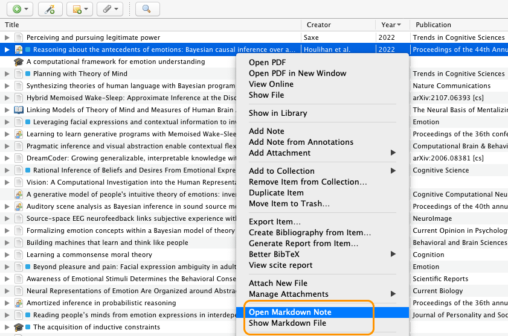
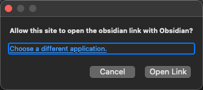

[](https://github.com/daeh/zotero-markdb-connect/releases/latest) [](https://github.com/daeh/zotero-markdb-connect/releases/latest) [](https://github.com/daeh/zotero-markdb-connect/releases/latest)

<!-- [](https://github.com/daeh/zotero-markdb-connect/releases/tag/v0.0.27) -->

<!-- [](https://github.com/daeh/zotero-markdb-connect/releases/tag/v0.1.7) [](https://github.com/daeh/zotero-markdb-connect/releases/tag/v0.1.7) -->

<!-- [](https://github.com/daeh/zotero-markdb-connect/releases/tag/v0.1.7) [](https://github.com/daeh/zotero-markdb-connect/releases/tag/v0.0.27) -->

<!-- [](https://github.com/daeh/zotero-markdb-connect/releases/latest) [](https://github.com/daeh/zotero-markdb-connect/releases/latest) -->

# MarkDB-Connect (Zotero Markdown DataBase Connect)

[](https://www.zotero.org) [](https://github.com/windingwind/zotero-plugin-template)

- **_Scans your Markdown database and adds a colored tag to associated Zotero items._**
- **_Jump to Markdown notes from the contextual menu of Zotero items._**
- **_Supports various Markdown databases, including [Obsidian](https://obsidian.md), [logseq](https://logseq.com), and [Zettlr](https://www.zettlr.com)._**
- **_Zotero 8 compatible._**



This is a plugin for [Zotero](https://www.zotero.org), a research source management tool. The _MarkDB-Connect_ plugin searches a user-defined folder for markdown files that include a [Better BibTeX](https://retorque.re/zotero-better-bibtex/) citekey or Zotero-Item-Key, and adds a colored tag to the corresponding Zotero items.

This plugin was initially designed with the [Obsidian](https://obsidian.md) markdown editor in mind, and was inspired by the [obsidian-citation-plugin](https://github.com/hans/obsidian-citation-plugin) workflow. It offers preliminary support for [logseq](https://logseq.com) and [Zettlr](https://www.zettlr.com). It can be adapted to other databases that store markdown files outside of Zotero, and to other workflows that generate markdown reading notes linked to Zotero items (such as Zotero's `Export Note` feature).

Please post any bugs, questions, or feature requests in the GitHub repository's [issues](https://github.com/daeh/zotero-markdb-connect/issues?q=is%3Aissue+is%3Aopen+sort%3Aupdated-desc).

## Plugin Functions

Adds a colored tag to Zotero items for which there are associated reading notes in an external folder.

Supports multiple markdown files for a single Zotero item.

Opens an existing markdown note in [Obsidian](https://obsidian.md), [logseq](https://logseq.com), or the system's default markdown note editor (e.g. [Zettlr](https://www.zettlr.com), [Typora](https://typora.io)) from the contextual menu of a Zotero item.

## Installation

- Download the plugin (the `.xpi` file) from the [latest release](https://github.com/daeh/zotero-markdb-connect/releases/latest)
- Open Zotero (version 7.x of 8.x)
- From `Tools -> Plugins`
- Select `Install Add-on From File...` from the gear icon ⛭
- Choose the `.xpi` file you downloaded (e.g. `markdb-connect.xpi`)
- Restart Zotero

> [!NOTE]
> The last release for Zotero 6 was [`v0.0.27`](https://github.com/daeh/zotero-markdb-connect/releases/tag/v0.0.27).

## Setup

A markdown file can specify which Zotero item it's linked to using either a [Better BibTeX](https://retorque.re/zotero-better-bibtex/) citekey or a Zotero-Item-Key. I recommend using Better BibTeX citekeys when possible.

1. Using **Better BibTeX citekeys** to link markdown files to Zotero items.
   - This is recommended if you created the markdown notes with [obsidian-citation-plugin](https://github.com/hans/obsidian-citation-plugin), [BibNotes Formatter](https://github.com/stefanopagliari/bibnotes), or [Obsidian Zotero Integration](https://github.com/mgmeyers/obsidian-zotero-integration).

   - The BetterBibTeX citekey can be taken from the filename, YAML metadata, or body of the markdown note.

   - FYI There's a nice [configuration tutorial](https://publish.obsidian.md/history-notes/Option+-+Link+from+a+Zotero+item+back+to+related+notes+in+Obsidian) detailing a common use case (thanks to Prof. Elena Razlogova).

2. Using **Zotero Item Keys** to link markdown files to Zotero items.
   - This is recommended if you created the markdown notes with the `Export Note` feature of Zotero.

   - The markdown note contents should include the Zotero-Item-Key in a consistent format.

NOTE: multiple markdown files can point to the same Zotero item. But a given markdown file should only be linked to a single Zotero item. A markdown reading note can reference multiple Zotero items throughout the file, but _MarkDB-Connect_ will only link the markdown note to one BetterBibTeX-citekey / Zotero-Item-Key.

---

### Option 1: Using BetterBibTeX citekeys

_MarkDB-Connect_ can extract the BetterBibTeX citekey that specifies which Zotero Item a markdown note corresponds to. The BetterBibTeX citekey can be taken from a markdown file's filename, [YAML metadata](https://help.obsidian.md/Advanced+topics/YAML+front+matter), or elsewhere in the file's contents.

<details>

<summary>configuration details</summary>

- In Zotero's Settings, click the `MarkDB-Connect` preference pane.
  - Specify the location of the folder that contains your markdown reading notes (e.g. `/Users/me/Documents/ObsVault/ReadingNotes/`). The _MarkDB-Connect_ plugin will recursively search this path for markdown files.

  - By default, _MarkDB-Connect_ expects that the filenames of your markdown reading note files begin with `@mycitekey` but can include extra information after it (e.g. a reading note with the BetterBibTeX citekey `shepard1987science` could have the filename `@shepard1987science.md` or `@shepard1987science Toward a universal law of generalization for psychological science.md`).
    - If your BetterBibTeX citekeys contain certain special characters (e.g. `:`, `/`), you will need to extract the citekeys from the markdown file's contents rather than its filename.

  - If the default does not match your use case, you can specify how to extract BetterBibTeX citekeys.
    - **A. filename** - Select `Custom File Filter` and define a RegExp with a single capturing group.
      - E.g. the default is `^@(\S+).*\.md$`, which looks for files beginning with `@` and uses the first word as the BetterBibTeX citekey.

    - **B. metadata** - Select `BetterBibTeX citekey - taken from YAML metadata` and specify a keyword from the notes' YAML frontmatter (here's an [example](#example-markdown-note)).
      - For info on metadata syntax, see [YAML front matter](https://help.obsidian.md/Advanced+topics/YAML+front+matter).

    - **C. contents** - Select `BetterBibTeX citekey - captured with custom RegExp` and define a RegExp with a single capturing group to return exactly 1 match per file.

- Run the synchronization function from `Tools -> MarkDB-Connect Sync Tags`.
  - This will add a tag (`ObsCite`) to every Zotero item for which there exists a reading note in the external folder you specified.

- In the `Tags` plane of Zotero, right-click on the `ObsCite` tag and assign it a color, which will mark the tagged items in the preview plane of Zotero. (In the screenshot above, Zotero items associated with reading notes are marked with a 🟦 blue tag.)

</details>

---

### Option 2: Using Zotero Item Keys

_MarkDB-Connect_ can extract the Zotero-Item-Key that specifies which Zotero Item a markdown note corresponds to. The Zotero-Item-Key is taken from the markdown file contents using a custom RegExp pattern.

Zotero automatically generates Item Keys, they take the form of `ABCD1234`, as in `zotero://select/library/items/ABCD1234`. NB this is not the same as the BetterBibTeX citekey you assigned an item (e.g. `mycitekey` in `zotero://select/items/@mycitekey`).

<details>

<summary>configuration details</summary>

- In Zotero's Settings, click the `MarkDB-Connect` preference pane.
  - Specify the location of the folder that contains your markdown reading notes (e.g. `/Users/me/Documents/ObsVault/ReadingNotes/`). The _MarkDB-Connect_ plugin will recursively search this path for markdown files.
    - The default behavior is to search for markdown files beginning with `@`.

    - Alternatively, you can define a custom RegExp pattern to match your reading note files.

  - Select the `Match Markdown Files to Zotero Items Using:` `Zotero-Item-Key - captured with custom RegExp` option.

  - Specify a RegExp pattern to extract the Zotero-Item-Key from the markdown contents.

    E.g. if your note has the line

    `- local:: [local zotero](zotero://select/library/items/GZ9DQ2AM)`

    you could extract the Zotero key (`GZ9DQ2AM`) using this RegExp pattern:

    `^- local::.+\/items\/(\w+)\)`

- Run the synchronization function from `Tools -> MarkDB-Connect Sync Tags`.
  - This will add a tag (`ObsCite`) to every Zotero item for which there exists a reading note in the external folder you specified.

- In the `Tags` plane of Zotero, right-click on the `ObsCite` tag and assign it a color, which will mark the tagged items in the preview plane of Zotero. (In the screenshot above, Zotero items associated with reading notes are marked with a 🟦 blue tag.)

</details>

---

## Example Markdown Note

In this example markdown note (`@saxe2017emobtom.md`), _MarkDB-Connect_ will use the [YAML metadata](https://help.obsidian.md/Advanced+topics/YAML+front+matter) keyword `citekey` to find the BetterBibTeX citekey (`saxe2017emobtom`) that determines which Zotero item to associate with the markdown file. Notice that the markdown file can include other BetterBibTeX citekeys and Zotero-Item-Keys, which are ignored by the plugin.

```markdown
---
citekey: saxe2017emobtom
zoterouri: zotero://select/library/items/IACZMXU4
bbturi: zotero://select/items/@saxe2017emobtom
doi: 10.1016/j.copsyc.2017.04.019
---

# @saxe2017emobtom

**Formalizing emotion concepts within a Bayesian model of theory of mind**
(2017) _Current Opinion in Psychology_
[Open in Zotero](zotero://select/library/items/IACZMXU4)

The body of notes can include references to other Zotero items.
The _MarkDB-Connect_ plugin will only link this file to one Zotero item
(in this case, it will use the value of the `citekey` property).

Here are links to other papers:

- This one uses [a Zotero URI](zotero://select/library/items/4RJ97IFL)

- This one uses [a BetterBibTeX URI](zotero://select/items/@anzellotti2021opaque)

- This one uses an Obsidian wiki link: [[@cusimano2018cogsci]]
```

<details>

<summary>Example Templates</summary>

Below are example templates for various Obsidian plugins

#### Template for [obsidian-citation-plugin](https://github.com/hans/obsidian-citation-plugin)

```md
---
citekey: "{{citekey}}"
title: "{{title}}"
year: {{year}}
authors: [{{authorString}}]
{{#if containerTitle~}} publication: "{{containerTitle}}" {{~else~}} {{~/if}}
{{#if DOI~}} doi: "{{DOI}}" {{~else~}} {{~/if}}
aliases: ["@{{citekey}}", "@{{citekey}} {{title}}"]
tags: 
 - readingNote
---

# @{{citekey}}

**{{title}}**
{{authorString}}
{{#if year~}} ({{year}}) {{~else~}} {{~/if}} {{~#if containerTitle}} _{{containerTitle~}}_ {{~else~}} {{~/if}}
[Open in Zotero]({{zoteroSelectURI}})
```

#### Template for ZotLit

Make a file (e.g. `zotlit-properties.eta.md`) with the following contents, and point to that file in ZotLit settings: `Template` > `Note Properties`.

```eta
citekey: "<%= it.citekey %>"
title: "<%= it.title %>"
<% if (it.date) { %>year: <%= it.date %><% } %>
authors: [<%= it.authors.map(v => v.firstName v.lastName) %>]
<% if (it.publicationTitle) { %>publication: "<%= it.publicationTitle %>"<% } %>
<% if (it.DOI) { %>doi: "<%= it.DOI %>"<% } %>
aliases: ["@<%= it.citekey %>", "@<%= it.citekey %> <%= it.title %>"]
tags:
 - readingNote
```

</details>

## Suppressing the Zotero security notification

Recent builds of Zotero have introduced a security notification for external links. At present, Zotero does not remember the user's link preferences, so this alert is shown every time an application-specific URI is launched. You can suppress this warning by setting `security.external_protocol_requires_permission` to `false` in Zotero's advanced configuration.



<details>

<summary>Instructions for modifying Zotero's advanced config</summary>

1. Open Zotero Settings
2. Click the "Advanced" tab
3. Click the "Config Editor" button
4. Click the "Accept Risk and Continue" button
5. Search for `security.external_protocol_requires_permission`
6. Double click the `security.external_protocol_requires_permission` item to toggle its value to `false`

</details>

## Related Projects

- [obsidian-citation-plugin](https://github.com/hans/obsidian-citation-plugin) by hans
  - Obsidian plugin that integrates your Zotero database with Obsidian.
- [BibNotes Formatter](https://github.com/stefanopagliari/bibnotes) by stefanopagliari
  - Obsidian plugin to facilitate exporting annotations from Zotero into Obsidian.
- [Obsidian Zotero Integration](https://github.com/mgmeyers/obsidian-zotero-integration) by mgmeyers
  - Obsidian plugin to facilitate exporting annotations from Zotero into Obsidian.
- [Zotero 6 'Export Notes' feature](https://forums.zotero.org/discussion/93521/available-for-beta-testing-markdown-export-of-notes/p1) by Zotero
  - Zotero 6 beta feature to export notes and annotations from Zotero items as markdown files.
- [Zotero to Markdown](https://github.com/e-alizadeh/Zotero2md) by e-alizadeh
  - Python library to export annotations and notes from Zotero items as markdown files.
- [Zotero Better Notes](https://github.com/windingwind/zotero-better-notes) by windingwind
  - A Zotero plugin for note management.
- [Logseq Citations Plugin](https://github.com/sawhney17/logseq-citation-manager) by sawhney17
  - Logseq plugin that integrates your Zotero database with Logseq.

<!-- [Zotero-mdnotes](https://argentinaos.com/zotero-mdnotes/) by argenos
Zotero plugin to export metadata and notes from Zotero items as markdown files. -->

## Notes

[GitHub](https://github.com/daeh/zotero-markdb-connect): Source code repository

This extension uses the [zotero-plugin-template](https://github.com/windingwind/zotero-plugin-template).

## License

Distributed under the MIT License.

## Author

[](https://daeh.info) [](https://bsky.app/profile/dae.bsky.social)
